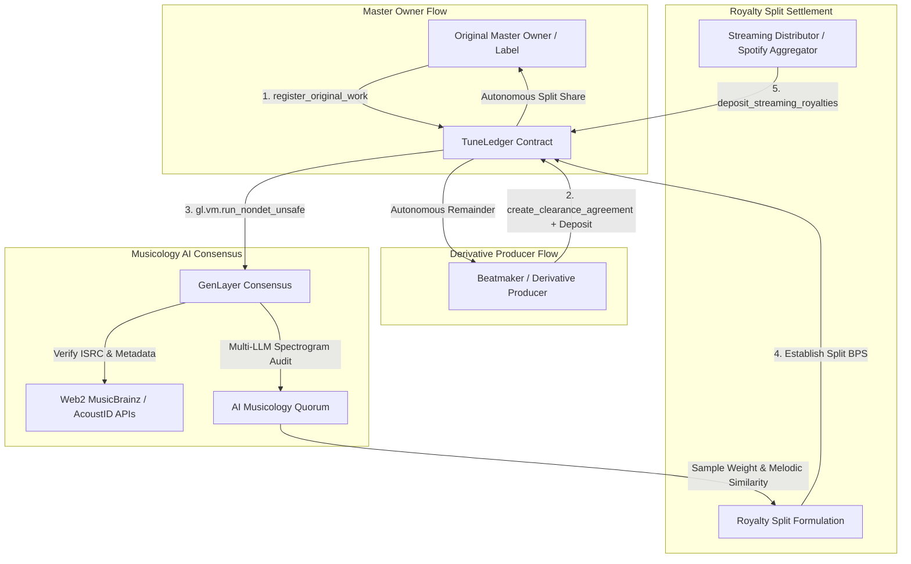

# 🎵 TuneLedger — Music Copyright, Sample Clearance & Royalty Escrow Protocol

> **Autonomous Musicology Spectrogram Consensus & Audio Fingerprint Oracle for Instant On-Chain Royalty Splitting on GenLayer.**

TuneLedger brings decentralized sample clearance and streaming royalty escrow to music producers, beatmakers, and record labels. Producers register master tracks with ISRC codes and audio fingerprints, sample agreements are negotiated on-chain, and GenLayer's Multi-LLM Musicology Quorum cross-references online registries (MusicBrainz, AcoustID, ISRC) to calculate harmonic similarity and duration weights, automatically executing permanent streaming royalty splits without publishing middle-men.

---

## 🏛 Architecture Overview



---

## 📐 Mathematical Royalty Formulation

$$\text{Sample Weight } W = \frac{\text{Duration Sampled (sec)}}{\text{Total Track Length (sec)}} \times 100$$

$$\text{Combined Score} = \frac{W \times 0.60 + \text{Melodic Similarity (0-100)} \times 0.40}{100}$$

$$\text{Royalty Split BPS} = \min\left(5000, \max\left(500, \text{Combined Score} \times 5000\right)\right)$$

Where:
- $\text{Royalty Split BPS} \in [500, 5000]$ (Between $5.00\%$ and $50.00\%$).
- **Streaming Distribution**: Original master owner receives $\text{Split BPS} / 10000$, derivative producer receives $1 - (\text{Split BPS} / 10000)$.

---

## 🔒 Contract Storage & Methods

### Contract Specification
- **Language**: Python (`py-genlayer:1jb45aa8ynh2a9c9xn3b7qqh8sm5q93hwfp7jqmwsfhh8jpz09h6`)
- **Total Methods**: 11 (5 Write, 6 View)

### Public Write Methods
1. `register_original_work(work_id, title, isrc_code, audio_fingerprint_hash)`: Register original master rights.
2. `create_clearance_agreement(agreement_id, original_work_id, derivative_title, sample_duration_sec, total_track_sec)` [Payable]: Request sample clearance with deposit (min 1 GEN).
3. `evaluate_sample_clearance(agreement_id, audio_analysis_proof, musicology_registry_url)`: Trigger AI consensus oracle to audit sample similarity and establish permanent on-chain split.
4. `deposit_streaming_royalties(agreement_id)` [Payable]: Streaming distributor deposits earnings; contract splits royalties autonomously according to verified split ratio.
5. `dispute_sample(agreement_id, dispute_reason)`: Rightsholder disputes unauthorized interpolation.

### Public View Methods
1. `get_original_work(work_id)`: Query master rights data.
2. `get_agreement(agreement_id)`: Query clearance status, royalty split BPS, and total disbursed revenue.
3. `get_records(agreement_id)`: Historical audit records and musicology rationales.
4. `list_original_works()`: List all registered original works.
5. `list_agreements(original_work_id)`: List sample agreements for a track.
6. `get_protocol_overview()`: Protocol statistics and global counters.

---

## 🧪 Testing & Verification

```bash
# Lint and validate GenVM contract
genvm-lint check contracts/tuneledger_royalty.py

# Run direct-mode test suite
.venv/bin/pytest contracts/test/ -v
```

### Test Results:
```text
✓ test_initial_protocol_overview
✓ test_register_original_work_success
✓ test_register_original_work_empty_fields_rejection
✓ test_register_duplicate_work_rejection
✓ test_create_clearance_agreement_success
✓ test_create_clearance_agreement_invalid_durations_rejection
✓ test_create_clearance_agreement_unregistered_work_rejection
✓ test_evaluate_sample_clearance_approved
✓ test_evaluate_sample_clearance_rejected
✓ test_deposit_streaming_royalties_success
✓ test_deposit_streaming_royalties_unapproved_rejection
✓ test_dispute_sample_success
✓ test_list_original_works_and_agreements
============================== 13 passed in 0.29s ==============================
```
